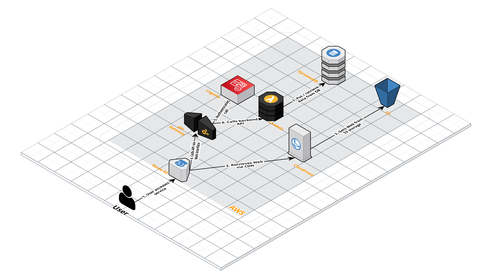

# longurl.rip

[](http://commitizen.github.io/cz-cli/)


## Table of Contents

* [Installation](#installation)
* [Core Actions](#core-actions)
  * [Linting](#linting)
  * [Testing](#testing)
  * [Building](#building)
  * [Deploying](#deploying)
* [Development](#development)
  * [Debugging](#debugging)
* [TODO](#todo)
* [Diagrams](#diagrams)
  * [Architectural Diagram](#architectural-diagram)
  * 
## Installation

```shell
npm i
```

## Core Actions
### Linting
```shell
nx lint <project>
```

### Testing
```shell
nx test <project>
```

### Building
```shell
nx build <project>
```

For `API` we have `build:express` & `build:lambda` to build for deployment on Docker or on serverless Lambda/Cloud Functions etc.

### Deploying
```shell
nx deploy infra
```

## Development
You can start local development of all dependencies and components by running
```shell
docker compose up
```
or by running the included IntelliJ Run Configuration
`[Docker] Up`
### Debugging
To debug an app use included IntelliJ Run Configuration 

API: `[API][Docker] Debug`

## TODO
- [x] API
- [x] API Docker
- [x] API Lambda
- [ ] Web
- [ ] Web S3 & CDN
- [ ] API Cognito
- [ ] API Auth

## Diagrams
### Architectural Diagram


